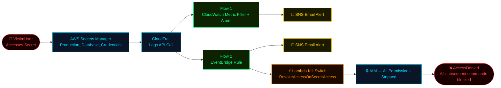

  

-----

**Cybersecurity professional with a background in intelligence operations.**  
I build hands-on labs, document everything, and focus on threat detection, SIEM, log analysis, and incident response.

Open to **Junior SOC Analyst** roles in the UK.

-----

## About Me

- 🔐 ISC² Certified in Cybersecurity (CC) — December 2025
- 📚 Cybersecurity Diploma — AltSchool Africa (final semester)
- 🛡️ Intelligence operations background — threat assessment, security analysis, operational reporting
- 🇬🇧 Based in the United Kingdom

-----

## 🔴 Live: AWS Kill-Switch Flow

-----

## Projects

### ☁️ Cloud Security Monitoring System — AWS *(Feb 2026)*

**Skills:** AWS · CloudTrail · CloudWatch · EventBridge · SNS · Lambda · IAM · Incident Response

Built a real-time security monitoring and automated response system on AWS. Planted a honeytoken secret in AWS Secrets Manager to trap unauthorised access. Set up two independent detection flows — CloudWatch Metric Filter with Alarm, and an EventBridge rule using wildcard pattern matching. Both flows trigger instant SNS email alerts. Wrote a Lambda kill-switch that automatically strips all IAM permissions from the user who accessed the trap. Ran a full simulation as “VictimUser” — alerts fired, permissions revoked, all subsequent commands returned AccessDenied. Deployed and tested end-to-end in eu-west-2.  
→ *[View Repo](https://github.com/bigmyk-e/aws-cloud-security-monitoring)*

-----

### 🛡️ Wazuh SIEM Deployment & Endpoint Monitoring *(Dec 2025 – Jan 2026)*

**Skills:** SIEM · Wazuh · File Integrity Monitoring · Windows Server · GDPR · SOC workflows

Deployed a Wazuh SIEM environment in a virtual lab to monitor Windows Server endpoints. Configured Wazuh Manager and agents from scratch, enabled File Integrity Monitoring, and verified alerts triggered correctly for file creation, modification, and deletion. Reviewed security events through the dashboard and mapped findings to GDPR compliance requirements to understand how SIEM supports regulatory monitoring.  
→ *[View Repo](https://github.com/bigmyk-e/wazuh-siem-deployment)*

-----

### 🔥 Sophos NGFW Deployment & Security Policy Configuration *(Nov – Dec 2025)*

**Skills:** Network Security · Firewall Administration · Deep Packet Inspection · VMware Fusion · Kali Linux

Deployed a Sophos Next-Generation Firewall inside a VMware Fusion lab on macOS. Configured LAN and WAN interfaces with static addressing, applied firewall rules for LAN-to-WAN traffic and restricted web access, and enabled Deep Packet Inspection and web filtering. Used Kali Linux to test connectivity, policy enforcement, and inspection rules. Documented every step for reproducibility.  
→ *[View Repo](#)*

-----

### 🌐 Company-Grade Network Security Lab — Cisco Packet Tracer *(Sep – Oct 2025)*

**Skills:** Network Design · VLANs · ACLs · Routing & Switching · SSH · Cisco IOS

Built a simulated enterprise network in Cisco Packet Tracer with separate VLANs (10, 20, 30) for Admin, Sales, and IT. Configured Router-on-a-Stick for inter-VLAN routing, applied ACLs to enforce least-privilege access between departments, and enabled SSH for secure remote management. Built both logical and physical topology diagrams. Hit a real-world issue mid-build — ACLs blocked legitimate traffic until I understood Cisco ACLs are stateless and require explicit echo-reply rules for pings to work.  
→ *[View Repo](#)*

-----

### 🖥️ Virtualization & Vulnerability Assessment Lab *(Sep – Oct 2025)*

**Skills:** Active Directory · VMware · Nmap · Enum4Linux · Hydra · Penetration Testing

Built a virtualized enterprise environment on VMware with Windows Server 2022 as Domain Controller running Active Directory and DNS, and a Windows 11 client joined to the domain. Used Kali Linux for reconnaissance and security testing — network scanning with Nmap, enumeration with Enum4Linux, and password attack simulation with Hydra. Analysed authentication errors and domain trust issues throughout. The main takeaway: small misconfigurations compound quickly and have real impact on system integrity.  
→ *[View Repo](#)*

-----

### 🎣 Phishing Analysis Challenges *(2025 – Documentation in progress)*

**Skills:** Email header analysis · IOC extraction · URL analysis · Threat intelligence

Completed phishing analysis challenges covering malicious email dissection, header inspection, URL and attachment analysis, and IOC identification. Screenshots captured. Write-ups in progress.  
→ *[View Repo — Coming soon](#)*

-----

### 🏦 Secure Architecture Design — Fintech Platform *(AltSchool Africa)*

**Skills:** Security Architecture · Zero Trust · Defence in Depth · Threat Modelling · Compliance

Designed a secure infrastructure for a fictional fintech platform as part of AltSchool’s Security Architecture module. Covered network segmentation, access control, encryption strategy, and compliance requirements. Full report available on request.  
→ *[View Repo](#)*

-----

### 🔍 Vulnerability Scanning Lab — OpenVAS / Greenbone

**Skills:** Vulnerability Assessment · Network Scanning · CVE Analysis · Risk Prioritisation · Ubuntu

Set up a Greenbone Vulnerability Management environment on an Ubuntu VM. Ran authenticated and unauthenticated scans, analysed CVE findings by severity, and documented remediation steps for each identified vulnerability.  
→ *[View Repo](#)*

-----

### 🖥️ SOC Home Lab — TryHackMe *(Ongoing)*

**Skills:** Log analysis · Threat detection · Incident triage · SIEM fundamentals

Working through the SOC Level 1 path — currently 15% through (12 of 65 rooms), with Splunk: The Basics up next. 76 rooms completed overall across the platform. Top 7% globally. Documenting walkthroughs and key findings as I go.  
→ *[View Repo](#)*

-----

### 🕵️ Intelligence & Security Analysis *(Professional — Ongoing)*

**Skills:** OSINT · Threat Assessment · Security Reporting · Analytical Writing

Active remote intelligence operations and security analysis work. This covers producing structured intelligence products, open-source research, and supporting operational security decisions. Details are operationally sensitive — happy to discuss in interview.

-----

## 🛠️ Tools & Technologies

|Category                |Tools                                                      |
|------------------------|-----------------------------------------------------------|
|Cloud Security          |AWS (CloudTrail, CloudWatch, EventBridge, Lambda, SNS, IAM)|
|SIEM                    |Wazuh, Splunk (learning), ELK Stack                        |
|Network Security        |Sophos NGFW, Cisco IOS, Nmap, Wireshark                    |
|Vulnerability Management|OpenVAS / Greenbone, Nmap, Enum4Linux                      |
|Virtualisation          |VMware Fusion, VirtualBox                                  |
|OS / Environments       |Ubuntu, Kali Linux, Windows Server 2022, macOS             |
|Scripting               |Python (basics)                                            |
|Platforms               |TryHackMe, HackerOne, Bugcrowd                             |

-----

## 📜 Certifications

**Active**

- ✅ **ISC² Certified in Cybersecurity (CC)** — Dec 2025 · Expires Dec 2028
- ✅ **Multicloud Network Associate** — Aviatrix · Sep 2025 · Expires Sep 2028
- ✅ **Cyber Security 101** — TryHackMe · Mar 2026
- ✅ **Pre Security** — TryHackMe · Aug 2025
- ✅ **Mastercard Cybersecurity Job Simulation** — Forage · Aug 2025
- ✅ **Networking Basics** — Cisco · Aug 2025
- ✅ **Introduction to Cybersecurity** — Cisco · Jun 2025
- ✅ **Foundations of Cybersecurity** — Google · Jul 2024

**In Progress**

- 🔄 **CompTIA Security+**
- 📚 **AltSchool Africa Cybersecurity Diploma** — Final semester

-----

## 📊 GitHub Stats

-----

## 🟥 TryHackMe

  

-----

## 📫 Connect

-----

*Building in public. Learning by doing. Open to junior SOC opportunities in the UK.*→ *[View Repo](#)*

-----

### 🎣 Phishing Analysis Challenges *(2025 – Documentation in progress)*

**Skills:** Email header analysis · IOC extraction · URL analysis · Threat intelligence

Completed phishing analysis challenges covering malicious email dissection, header inspection, URL and attachment analysis, and IOC identification. Screenshots captured and write-ups in progress.  
→ *[View Repo — Coming soon](#)*

-----

### 🏦 Secure Architecture Design — Fintech Platform *(AltSchool Africa)*

**Skills:** Security Architecture · Zero Trust · Defence in Depth · Threat Modelling · Compliance

Designed a secure infrastructure for a fictional fintech platform as part of AltSchool’s Security Architecture module. Covered network segmentation, access control, encryption strategy, and compliance requirements. Full report available on request.  
→ *[View Repo](#)*

-----

### 🔍 Vulnerability Scanning Lab — OpenVAS / Greenbone

**Skills:** Vulnerability Assessment · Network Scanning · CVE Analysis · Risk Prioritisation · Ubuntu

Set up a Greenbone Vulnerability Management environment on an Ubuntu VM. Ran authenticated and unauthenticated scans, analysed CVE findings by severity, and documented remediation steps for each identified vulnerability.  
→ *[View Repo](#)*

-----

### 🖥️ SOC Home Lab — TryHackMe *(Ongoing)*

**Skills:** Log analysis · Threat detection · Incident triage · SIEM fundamentals

Working through the SOC Level 1 path — currently 15% through (12 of 65 rooms), with Splunk: The Basics up next. 76 rooms completed overall across the platform. Top 7% globally. Documenting walkthroughs and key findings as I go.  
→ *[View Repo](#)*

-----

### 🕵️ Intelligence & Security Analysis *(Professional — Ongoing)*

**Skills:** OSINT · Threat Assessment · Security Reporting · Analytical Writing

Active remote intelligence operations and security analysis work. This covers producing structured intelligence products, open-source research, and supporting operational security decisions. Details are operationally sensitive — happy to discuss in an interview.

-----

## 🛠️ Tools & Technologies

|Category                |Tools                                                      |
|------------------------|-----------------------------------------------------------|
|Cloud Security          |AWS (CloudTrail, CloudWatch, EventBridge, Lambda, SNS, IAM)|
|SIEM                    |Wazuh, Splunk (learning), ELK Stack                        |
|Network Security        |Sophos NGFW, Cisco IOS, Nmap, Wireshark                    |
|Vulnerability Management|OpenVAS / Greenbone, Nmap, Enum4Linux                      |
|Virtualisation          |VMware Fusion, VirtualBox                                  |
|OS / Environments       |Ubuntu, Kali Linux, Windows Server 2022, macOS             |
|Scripting               |Python (basics)                                            |
|Platforms               |TryHackMe, HackerOne, Bugcrowd                             |

-----

## 📜 Certifications

**Active**

- ✅ **ISC² Certified in Cybersecurity (CC)** — Dec 2025 
- ✅ **Multicloud Network Associate** — Aviatrix · Sep 2025 
- ✅ **Cyber Security 101** — TryHackMe · Mar 2026
- ✅ **Pre Security** — TryHackMe · Aug 2025
- ✅ **Mastercard Cybersecurity Job Simulation** — Forage · Aug 2025
- ✅ **Networking Basics** — Cisco · Aug 2025
- ✅ **Introduction to Cybersecurity** — Cisco · Jun 2025
- ✅ **Foundations of Cybersecurity** — Google · Jul 2024

**In Progress**

- 🔄 **CompTIA Security+**
- 📚 **AltSchool Africa Cybersecurity Diploma** — Final semester

-----

## 📊 GitHub Stats

-----

## 📫 Connect

-----

*Building in public. Learning by doing. Open to junior SOC opportunities in the UK.*
